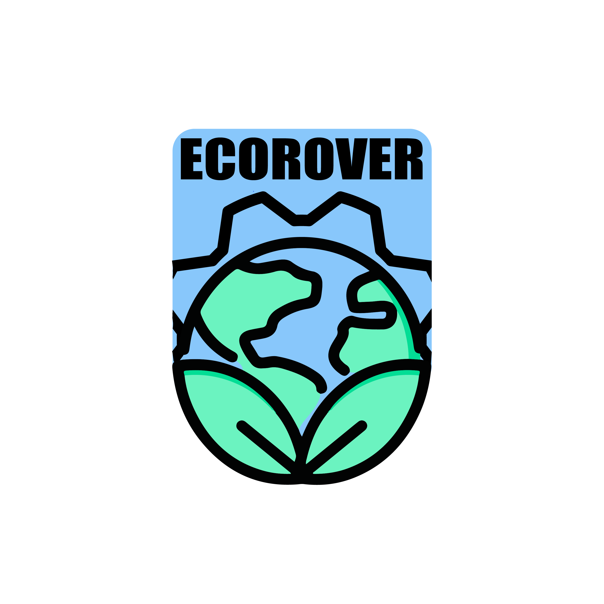

# EcoRover
A motorized recycling bin targeting food courts with a built-in fridge to store food left-overs so other people can use it. Helping saving our planet and increasing social Interdependence (A Stardance project)


<div align="center">
  
  &nbsp;&nbsp;
    
  &nbsp;&nbsp;
  
  &nbsp;&nbsp;
  
</div>
    &nbsp;&nbsp;

  [](https://creativecommons.org/licenses/by-nc/4.0/)
</div>

> **Note on AI Usage:** AI is being used in this project to brainstorm, explain and help debug. But it's not used to generate any part of the project that needs creativity, design, or building. And it's not used for more than 10% of the total project work, which counts as MADE BY HUMAN .

> **[The currnt state: waiting for funding, View Journal](https://github.com/your-username/ecorover)**

---

## ⚡ Quick Start
Since EcoRover is an embedded hardware project, you can explore the complete system architecture, hardware schematics, and project progression directly through our documentation:

1. **View the CAD & Wiring Schematics:** Check out the `/CAD and structure` and `/Electronics` directory for Fusion 360 exports and Fritzing circuit diagrams.
2. **Explore the Codebase:** Navigate to `/src` for the Arduino Mega 2560 control scripts.
3. **Track Development:** Read [`JOURNAL.md`](./JOURNAL.md) for complete technical devlogs and progress time-lapses.

---

## 🚀 Key Features

* **Dignity-Preserving Food Sharing:** Features an integrated, temperature-controlled compartment designed for food court leftovers so anyone in need can take meals without asking.
* **Smart Autonomous Navigation:** Uses 8x HC-SR04 ultrasonic sensors mapped to North, South, East, and West for full 360° obstacle avoidance in crowded environments.
* **Thermoelectric Cooling:** Houses an insulated storage area powered by a TEC1-12706 Peltier cooler driven via a 12V relay module to keep food fresh.
* **4-Way Waste Sorting:** Integrates a multi-hole trash intake system for easy recycling categorization.
* **Embedded Safety & Power Management:** Equipped with an inline fuse protection circuit and a master hardware rocker switch for instant power isolation, along with multiple access panels for maintenance and latches in case of an emergency -god forbid-.

---

## 💻 Local Setup & Development (Soon)

To compile and inspect the code or view hardware diagrams locally, ensure you have the following setup:

### Prerequisites
* **Arduino IDE:** v2.x or later
* **Microcontroller Board Package:** Arduino AVR Boards
* **CAD / Circuit Software (Optional):** Autodesk Fusion 360 & Fritzing

### Required Libraries
* `HCSR04` (Ultrasonic sensor library)
* `L298N` (Motor driver control library)

### Environment & Configuration
Pin definitions and driver logic are set up in `src/config.h`. 

### Flashing the Code
1. Clone this repository:
   ```bash
   git clone [https://github.com/your-username/ecorover.git](https://github.com/your-username/ecorover.git)
   cd ecorover
